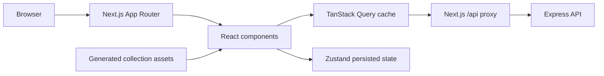

# Frontend Architecture

This document explains how the Mask Born Order frontend is organized, how data moves through it, and which conventions should be followed when extending it.

## Overview

The frontend is a Next.js App Router application in `frontend/`. It combines server-rendered route shells with client-side interactive components. The browser always calls the website's own `/api/*` path; a server-side Next.js proxy forwards those requests to the Express backend. This same-origin boundary allows the authentication cookie to work reliably without exposing the backend URL to browser code.

The major architectural layers are:



## Technology stack

The frontend currently uses:

- Next.js 16 with the App Router for routing, layouts, metadata, server route handlers, and production builds.
- React 19 and TypeScript in strict mode.
- TanStack Query 5 for remote/server state, caching, mutations, and cache invalidation.
- Zustand 5 for small pieces of browser-owned persistent state.
- Motion for page, card, navigation, and modal animation.
- Lenis for smooth scrolling.
- Lucide React for interface icons.
- Next Image for artwork and normal image delivery.
- Next `ImageResponse` for dynamic social-sharing artwork.
- Vitest for renderer and state tests.
- ESLint with the Next.js ruleset.
- Fontsource packages for locally bundled Bebas Neue and Work Sans fonts.

Tailwind is installed in the toolchain, but the visual system is currently authored mainly in `src/app/globals.css` with semantic class names rather than being structured as a Tailwind utility-codebase.

## Directory structure

```text
frontend/
├── public/                    Static site and collection assets
├── src/
│   ├── app/                   Routes, layouts, route handlers, and metadata images
│   │   ├── api/[...path]/     Same-origin backend proxy
│   │   ├── art/[slug]/        Public artwork page and dynamic social image
│   │   ├── collection/        Generated collection browser and sample image route
│   │   ├── mboadmin/          Protected administrator entry point
│   │   └── ...                Remaining public pages
│   ├── components/            Reusable and feature-level React components
│   ├── generated/             Collection manifest produced by the sync script
│   ├── hooks/                 Shared React hooks
│   ├── lib/                   API, renderer, preview, server-fetch, and shared types
│   └── store/                 Persisted Zustand stores
├── next.config.ts             Next.js configuration and backend rewrite
├── tsconfig.json              Strict TypeScript and `@/*` path alias
└── package.json               Frontend scripts and dependencies
```

The repository-level `scripts/sync-collection.mjs` command validates and copies generator data and artwork into frontend-owned generated files and public assets. Files in `src/generated/` should be regenerated through that command rather than edited manually.

## Route architecture

The root layout in `src/app/layout.tsx` owns global metadata, fonts, global CSS, providers, smooth scrolling, the site header, the page `<main>`, and the footer.

| Route | Responsibility |
| --- | --- |
| `/` | Landing page, featured collection work, and latest community work |
| `/collection` | Browsable generated collection samples |
| `/collection/sample/[id]` | Server-generated collection sample image response |
| `/community` | Searchable and sortable community submission feed |
| `/gallery` | Accepted community work and gallery filtering |
| `/art/[slug]` | Public submission detail, voting, preview variants, and sharing |
| `/art/[slug]/opengraph-image` | Dynamic 1200×630 social card for a submission |
| `/apply` | Membership/application builder flow |
| `/draw` | 32×32 artwork and trait editor |
| `/profile` | Current member's submissions, slots, drafts, and payout eligibility |
| `/connect/discord` | Backend wake-up and Discord continuation screen |
| `/mboadmin` | Non-indexed, API-gated administrator control room |
| `/api/[...path]` | Server-only proxy to the backend API |

Most `page.tsx` files remain small. They provide metadata and compose feature components. Interactive behavior is moved into client components under `src/components/`.

## Server and client component boundary

Components are server components unless they declare `"use client"`. Server components are used for route shells, static metadata, server-side submission lookup, and generated social images. Client components are used when a feature needs browser events, animation, React Query, Zustand, local storage, canvas-like editing, or responsive interaction state.

Keep the client boundary as low as practical. A route does not need to become a client component just because one section is interactive; it can render a focused client feature component instead.

## Data and API flow

Browser API calls go through the generic `apiFetch<T>()` helper in `src/lib/api.ts`:

```text
Client component
  → apiFetch('/submissions')
  → same-origin /api/submissions
  → src/app/api/[...path]/route.ts
  → BACKEND_URL/api/submissions
  → Express response
```

`apiFetch` always includes credentials, parses the backend's structured error response, and attaches fields such as `code`, `status`, `details`, and `requestId` to the thrown error. Feature code should use this helper instead of constructing backend URLs in the browser.

The catch-all proxy:

- forwards GET, POST, PUT, PATCH, DELETE, and HEAD requests;
- preserves request bodies, query strings, cookies, and useful headers;
- removes hop-by-hop headers;
- disables caching for authenticated API traffic;
- keeps `BACKEND_URL` server-only.

`next.config.ts` also contains a backend rewrite. The explicit route handler is the main application boundary because it gives the app control over request and response forwarding.

### Server-side API access

Server-only features cannot use the browser proxy in the same way. `src/lib/server-submission.ts` fetches a public submission directly from `BACKEND_URL`. The dynamic Open Graph image uses this helper to obtain the title, creator, artwork URL, categories, and current vote totals.

## Remote state with TanStack Query

`src/components/providers.tsx` creates one `QueryClient` for the browser. Queries default to a 30-second stale time and do not refetch merely because the window regains focus.

Remote state includes:

- the authenticated session;
- profile and submission-slot data;
- community submissions;
- gallery entries;
- individual artwork details;
- the admin review queue and abuse data.

Mutations should invalidate or update the relevant query keys after success. Authentication is centralized around the `['session']` query. `useCurrentUser()` treats a 401 response as a valid signed-out state rather than an application error, and deliberately refreshes session state when mounted.

Remote API records must not be duplicated into Zustand. TanStack Query remains the source of truth for backend-owned data.

## Browser state with Zustand

Zustand is reserved for state that belongs to the current browser.

### Session convenience store

`src/store/session.ts` persists locally entered X and wallet values under `maskborn-session-v1`. These values support the connection experience, but the backend session query is authoritative after an account has been created or recovered.

### Draft store

`src/store/draft.ts` owns the local drawing experience:

- title and description;
- one-of-one or accessory mode;
- 32×32 pixel layers;
- Background, Eyes, Hats, and Special layer kinds;
- active color and active layer;
- visibility and layer naming;
- undo and redo history;
- local update timestamps;
- server draft ID and optimistic version.

Persisted data is validated and normalized when restored. Coordinates are constrained to the canvas, colors are normalized, IDs are de-duplicated, and invalid legacy values are ignored. This prevents old local-storage data from breaking a newer editor.

The drawing UI also synchronizes drafts to backend draft endpoints. The local store provides immediate editing, while server IDs and versions support durable, conflict-aware saves.

## Artwork and collection rendering

There are two related visual systems.

### Generated origin collection

`src/generated/collection.json` is the frontend manifest for the origin generator. It contains collection metadata, trait definitions, legends, and generated sample references. `collection-browser.tsx`, the home carousel, the application builder, and the collection sample route consume this manifest and the synchronized assets under `public/collection/`.

`src/lib/maskborn-renderer.ts` implements the TypeScript renderer for the canonical 32×32 collection rules. Its test fixtures are checked against the source generator to protect render order, palette behavior, and compatibility rules.

### Community artwork

Published community work is loaded from the backend and displayed using its stored preview URL. Trait submissions may contain multiple preview variants. `src/lib/artwork-preview.ts` chooses the most complete default preview and converts backend category keys into human-readable labels.

`PixelArtwork` is the shared visual wrapper. It uses Next Image with smoothing-safe presentation for crisp pixel art. A caller should pass a real `source` for user artwork; its generated fixture fallback is intended only for origin-collection presentation.

## Voting model in the UI

One-of-one work receives a submission-level vote. Trait-extension work can expose vote targets for individual submitted layers/categories, allowing a viewer to vote on a Background, Eyes, Hat, Special layer, or the combined work as supported by the API response.

Voting components use optimistic local feedback but reconcile with the backend response. Authentication and verified-Discord requirements are checked before mutation; otherwise the connection modal is opened through the `maskborn:connect` browser event.

The backend remains responsible for vote-window timing, uniqueness, abuse controls, and final totals. The frontend should never infer authorization from visual state alone.

## Authentication and authorization

Authentication uses an HTTP cookie owned by the website origin. The frontend does not store the session token in JavaScript-accessible state.

The visible session flow is:

1. A visitor creates a profile with X attribution.
2. Discord OAuth verifies and recovers the durable identity.
3. An optional wallet is attached for application and payout use.
4. `useCurrentUser()` refreshes the canonical user record.

Disconnect actions must clear local convenience state and invalidate/reset the React Query session data so the UI changes immediately without a refresh.

Admin is intentionally located at `/mboadmin`, not `/admin`. The page is marked `noindex` and rendered through `AdminRouteGate`. The gate calls `/api/mboadmin/access`; unauthorized visitors are redirected home, and the dashboard JavaScript is dynamically loaded only after access succeeds. This is a user-experience optimization, not the security boundary—every backend admin endpoint must still enforce admin authorization.

## Social sharing and metadata

Global metadata lives in `src/app/layout.tsx` and uses `NEXT_PUBLIC_SITE_URL` as its production base.

Each `/art/[slug]` page has a dynamic `opengraph-image.tsx`. Next.js renders a 1200×630 PNG containing:

- the submitted artwork;
- artwork title and type;
- creator attribution;
- current upvote and downvote totals;
- a call to view and vote.

When an artwork link is shared to a service that reads Open Graph or X card metadata, that image becomes its visual preview. The image is forced dynamic so it can represent current submission data.

## Styling and responsive behavior

The visual system is centralized in `src/app/globals.css`. It uses CSS custom properties for the palette and semantic class names for components and page sections. The design combines neutral paper-like surfaces, dark borders, amber accents, strong display typography, and deliberately crisp pixel artwork.

Responsive behavior is implemented through CSS media queries plus small amounts of JavaScript where interaction behavior genuinely changes. For example, the site header uses `matchMedia('(max-width: 800px)')` to separate the mobile drawer from the desktop hover-expansion behavior.

When adding a component:

- begin with fluid dimensions and intrinsic layout;
- test narrow mobile, tablet, normal desktop, and wide desktop widths;
- avoid fixed widths that can exceed the viewport;
- keep horizontal scrolling limited to intentional rails such as filters or trait previews;
- preserve minimum touch-target sizes;
- verify long titles, usernames, and empty states;
- respect reduced-motion behavior when adding substantial animation.

## Environment configuration

The frontend uses these environment variables:

| Variable | Exposure | Purpose |
| --- | --- | --- |
| `NEXT_PUBLIC_SITE_URL` | Browser-safe | Canonical frontend origin used by metadata |
| `NEXT_PUBLIC_X_CAMPAIGN_POST_URL` | Browser-safe | Campaign post used by the application flow |
| `BACKEND_URL` | Server-only | Express backend origin used by proxy and server fetches |

Do not expose secrets with a `NEXT_PUBLIC_` prefix. In production, browser requests should remain same-origin and `BACKEND_URL` should point to the deployed backend.

## Development and verification

Run frontend commands from `frontend/`:

```bash
npm run dev
npm run check
npm run lint
npm test
npm run build
```

Run the collection synchronization command from the repository root whenever the source generator changes:

```bash
npm run sync:collection
```

The minimum verification for a normal frontend change is TypeScript plus ESLint. Changes to renderer, previews, draft persistence, voting, routing, proxy behavior, or production metadata should also run tests and a production build.

## Extension guidelines

Use this decision order when adding a feature:

1. Add or update the backend contract if the data is durable or shared between users.
2. Access backend data through `apiFetch` and TanStack Query.
3. Use Zustand only for browser-owned interactive or draft state.
4. Keep route files thin and place feature behavior in a focused component.
5. Reuse shared primitives such as `PixelArtwork`, pagination, loaders, API errors, and artwork-preview helpers.
6. Add truthful loading, error, empty, and unauthorized states; never use dummy production records as fallbacks.
7. Invalidate affected query keys after mutations.
8. Test responsive behavior and keyboard/touch interaction.
9. Run type checking, lint, relevant tests, and a production build.

## Important architectural rules

- The backend and database are authoritative for users, submissions, votes, gallery entries, restrictions, and payouts.
- Browser local storage must never be treated as proof of identity or permission.
- Browser code calls same-origin `/api/*`, not a public backend URL.
- Generated collection files are build artifacts and should not be hand-edited.
- A client-side admin gate is not a replacement for backend authorization.
- Empty API data must render an empty state, not fabricated community or profile data.
- Community artwork and origin-generator samples must remain clearly distinguished.
